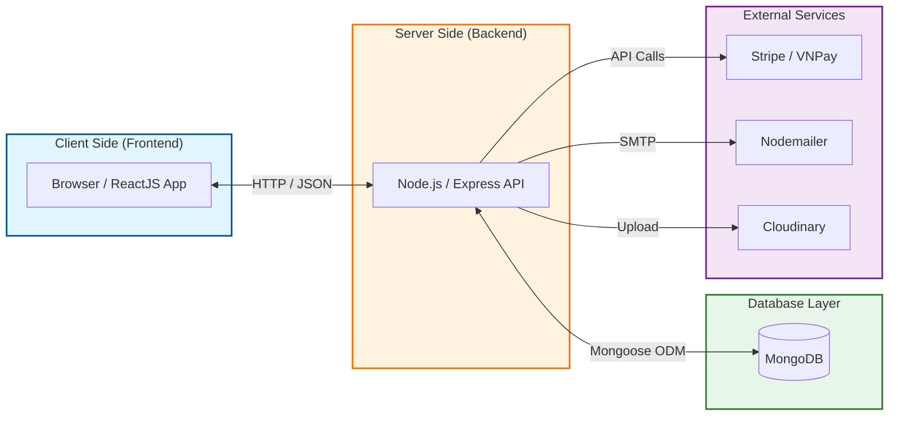
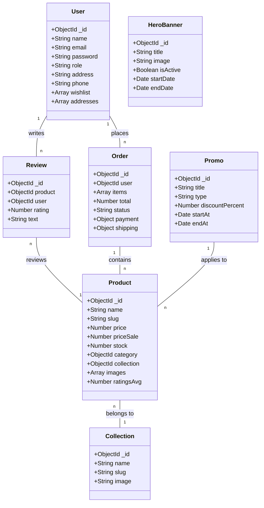

# 📊 Kịch Bản & Nội Dung Slide Báo Cáo Đồ Án HMJewelry

Dưới đây là nội dung chi tiết cho từng Slide theo yêu cầu của giảng viên.

---

## Slide 1: Thông Tin Chung
**Tiêu đề:** BÁO CÁO ĐỒ ÁN MÔN HỌC
**Môn:** Thương Mại Điện Tử

*   **Học viện:** Học viện Hàng không Việt Nam
*   **Khoa:** Công Nghệ Thông Tin
*   **Đề tài:** Xây dựng Website Thương mại điện tử kinh doanh trang sức (HMJewelry)
*   **Nhóm thực hiện:** Nhóm 8
*   **Giảng viên hướng dẫn:** (Điền tên GVHD của bạn)

**Danh sách thành viên:**
1.  Lê Dương Bảo (123456) - Nhóm trưởng
2.  Nguyễn Lê Hưng (234567)
3.  Phạm Thanh Tùng (345678)
4.  Trần Gia Nghĩa (456789)

---

## Slide 2: Công Nghệ Sử Dụng
*(Nên chia làm 2 cột hoặc dùng icon logo cho đẹp)*

**1. Frontend (Giao diện):**
*   **ReactJS + Vite:** Tốc độ tải trang nhanh, trải nghiệm mượt mà (SPA).
*   **Tailwind CSS:** Thiết kế giao diện hiện đại, chuẩn Responsive.
*   **Zustand:** Quản lý trạng thái (Giỏ hàng, User) hiệu quả.

**2. Backend (Hệ thống):**
*   **Node.js + Express:** Xây dựng RESTful API mạnh mẽ.
*   **MongoDB:** Cơ sở dữ liệu NoSQL linh hoạt, phù hợp TMĐT.
*   **Passport.js:** Xác thực bảo mật (Google/Facebook Login).

**3. Dịch vụ bên thứ 3:**
*   **Cloudinary:** Lưu trữ hình ảnh/video sản phẩm.
*   **Stripe / VNPay:** Tích hợp thanh toán trực tuyến.
*   **Nodemailer:** Gửi email tự động.

---

## Slide 3: Mô Hình Hệ Thống

*   **Client (Browser):** Người dùng tương tác qua giao diện ReactJS.
*   **Server (API):** Xử lý Logic, xác thực, tính toán đơn hàng.
*   **Database (Data):** Lưu trữ thông tin bền vững.
*   **External Services:** Kết nối API thanh toán, Email, Storage.

*(Gợi ý hình ảnh: Hình vẽ Client <-> Server <-> Database)*

---

## Slide 4: Biểu Đồ Use Case (Chức Năng)
*(Chèn hình Use Case Diagram tổng quát)*

**Các nhóm chức năng chính:**
1.  **Khách hàng (User):**
    *   Đăng ký, Đăng nhập (Email/Social).
    *   Tìm kiếm, Lọc sản phẩm.
    *   Quản lý Giỏ hàng, Wishlist.
    *   Đặt hàng & Thanh toán Online.
    *   Đánh giá sản phẩm.
2.  **Quản trị viên (Admin):**
    *   Quản lý Sản phẩm, Danh mục.
    *   Quản lý Đơn hàng (Duyệt/Hủy/Giao).
    *   Quản lý Banner, Mã giảm giá.
    *   Xem Báo cáo thống kê.

---

## Slide 5: Biểu Đồ Quan Hệ Dữ Liệu (ERD)
*(Chèn hình ERD mà bạn đã vẽ trong báo cáo)*

**Mô tả ngắn:**
*   **User** có quan hệ 1-n với **Order** (1 người có nhiều đơn).
*   **Order** có quan hệ n-n với **Product** (thông qua chi tiết đơn hàng).
*   **Product** thuộc về 1 **Collection** (Bộ sưu tập).
*   **Review** liên kết **User** và **Product**.

---

## Slide 6: Cơ Sở Dữ Liệu (MongoDB Collections)

Hệ thống sử dụng các Collections chính:
1.  `users`: Lưu thông tin tài khoản.
2.  `products`: Lưu thông tin sản phẩm (giá, ảnh, kho...).
3.  `orders`: Lưu đơn hàng và trạng thái.
4.  `collections`: Danh mục bộ sưu tập.
5.  `reviews`: Đánh giá của khách hàng.
6.  `herobanners`: Quản lý banner trang chủ.
7.  `promos`: Mã giảm giá.

---

## Slide 7: Chức Năng - Trang Chủ & Sản Phẩm
*(Chụp 2 hình ghép lại)*

*   **Trang chủ:** Banner động, Sản phẩm nổi bật, Top Collection.
*   **Chi tiết sản phẩm:** Zoom ảnh, chọn số lượng, xem đánh giá, sản phẩm liên quan.

---

## Slide 8: Chức Năng - Giỏ Hàng & Thanh Toán
*(Chụp 2 hình ghép lại)*

*   **Giỏ hàng:** Cập nhật số lượng Real-time, tính tổng tiền tự động.
*   **Thanh toán:** Form địa chỉ, chọn phương thức (COD/VNPay/Stripe), xác nhận đơn hàng.

---

## Slide 9: Chức Năng - Tài Khoản & Tiện Ích
*(Chụp 2 hình ghép lại)*

*   **Đăng nhập/Đăng ký:** Hỗ trợ Google/Facebook, Quên mật khẩu.
*   **Cá nhân:** Quản lý hồ sơ, Sổ địa chỉ, Lịch sử đơn hàng, Yêu thích.

---

## Slide 10: Chức Năng - Admin Dashboard
*(Chụp hình trang Dashboard)*

*   Thống kê doanh thu, số lượng đơn hàng mới.
*   Biểu đồ tăng trưởng trực quan.
*   Danh sách đơn hàng cần xử lý gấp.

---

## Slide 11: Chức Năng - Quản Lý Admin
*(Chụp hình trang Quản lý Sản phẩm hoặc Đơn hàng)*

*   **Sản phẩm:** Thêm/Sửa/Xóa, Upload ảnh lên Cloud.
*   **Đơn hàng:** Cập nhật trạng thái (Đang giao -> Đã giao).
*   **Khác:** Quản lý Banner, Mã giảm giá.

---

## Slide 12: Tổng Kết & Đánh Giá Thành Viên
*(Chụp bảng phân công công việc chi tiết ở dưới)*

### BẢNG ĐÁNH GIÁ MỨC ĐỘ HOÀN THÀNH

| STT | Thành viên | Nhiệm vụ chính | Mức độ hoàn thành | Đánh giá |
| :-- | :--- | :--- | :---: | :---: |
| 1 | **Lê Dương Bảo** | Leader, Backend Core, Payment, Deploy | 100% | Xuất sắc |
| 2 | **Nguyễn Lê Hưng** | Admin Dashboard, System Management | 100% | Tốt |
| 3 | **Phạm Thanh Tùng** | Frontend UI, Cart Logic, Responsive | 100% | Tốt |
| 4 | **Trần Gia Nghĩa** | Product Feature, Testing, Report | 100% | Tốt |

*(Lưu ý: Bạn có thể thay đổi cột Đánh giá tùy theo thực tế nhóm)*

---

## Slide Cuối: Cảm Ơn
**DEMO WEBSITE**
Link: https://hmjewelry.vercel.app/

**CẢM ƠN THẦY VÀ CÁC BẠN ĐÃ LẮNG NGHE!**
*(Thông tin liên hệ nếu cần)*
